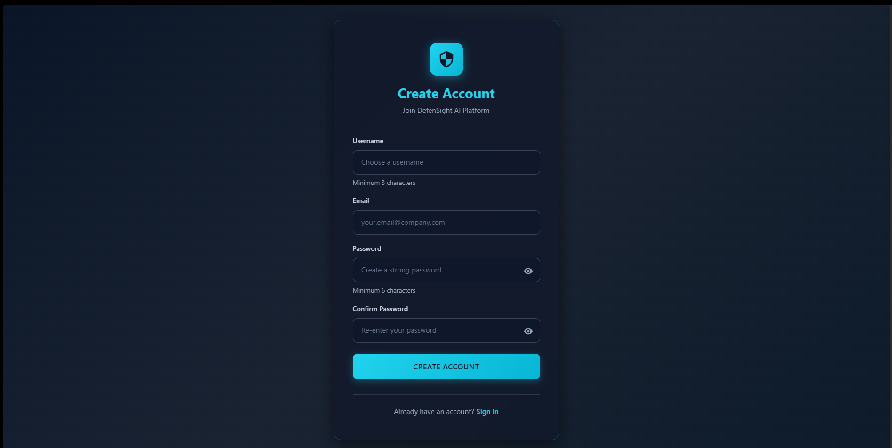
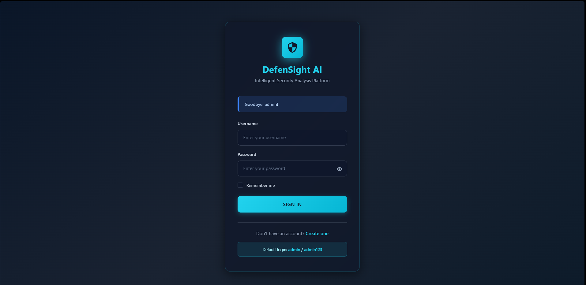
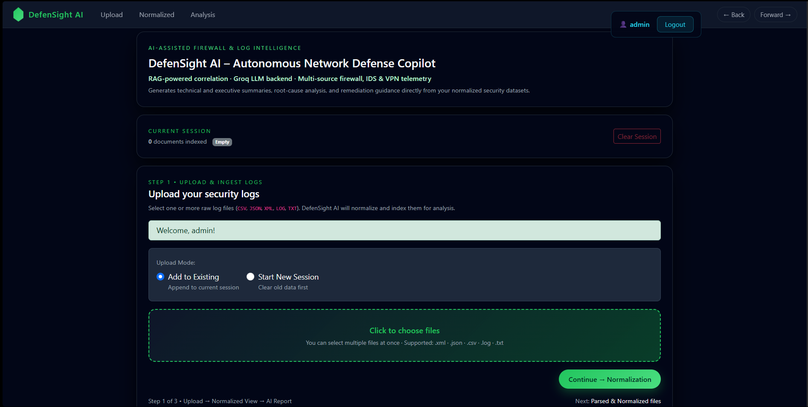
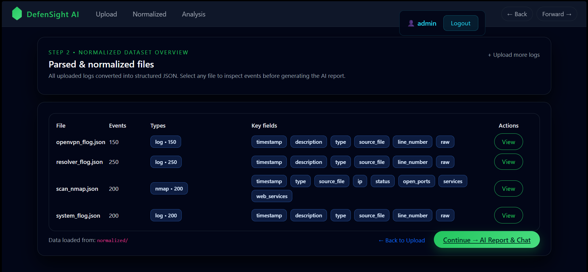
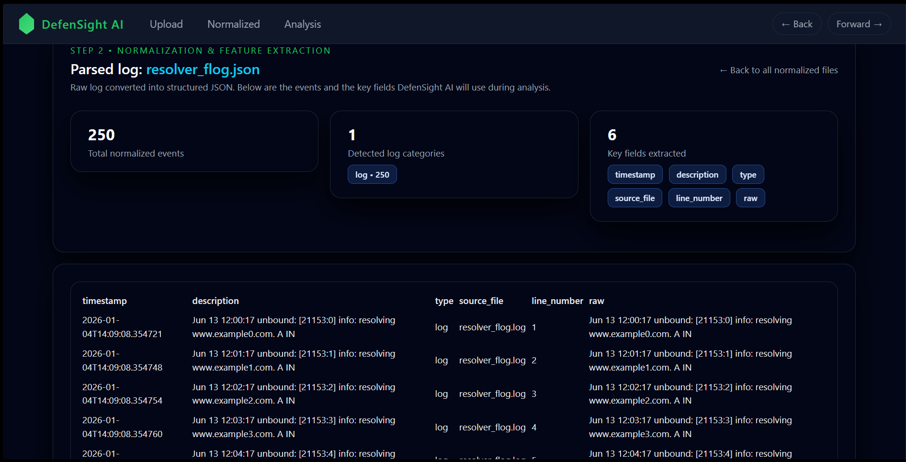
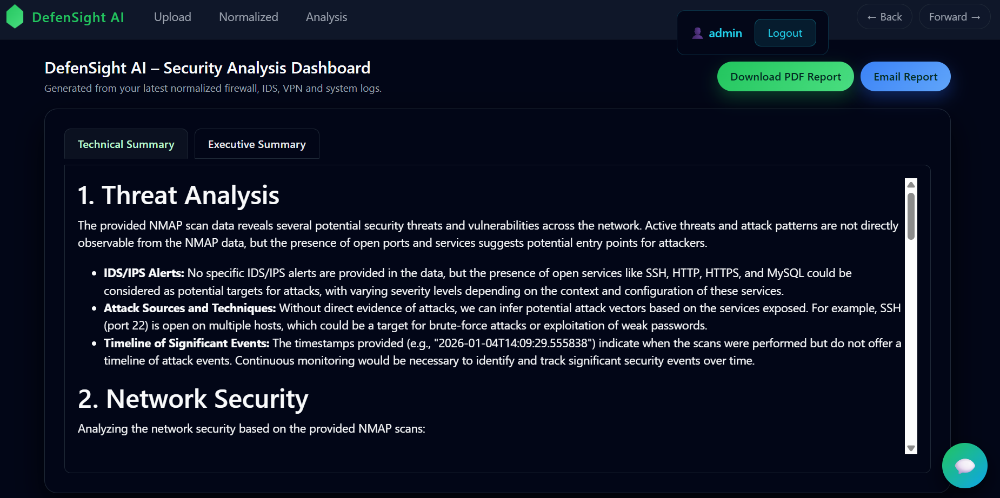
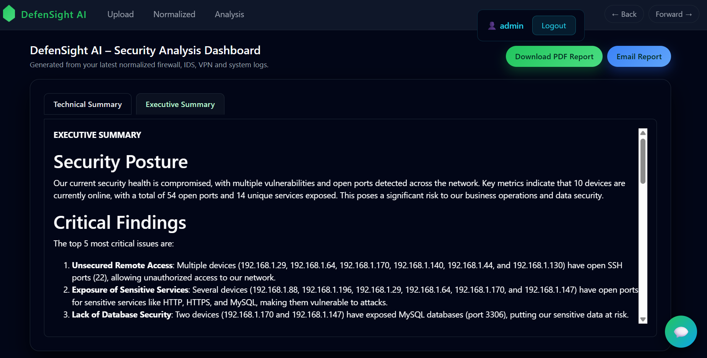
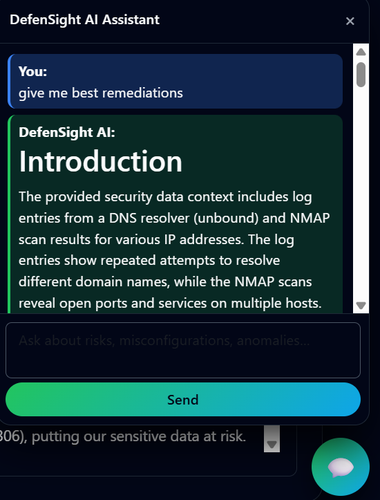
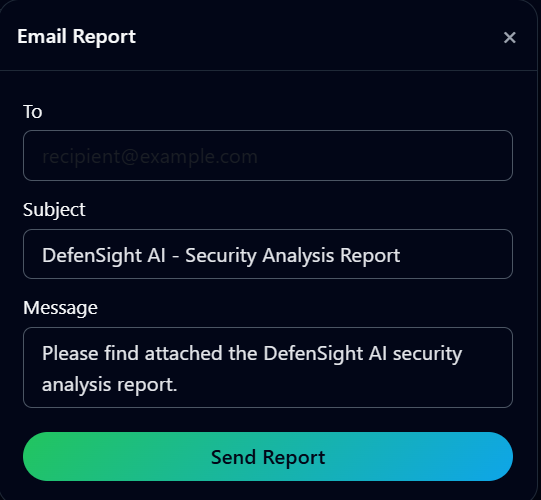
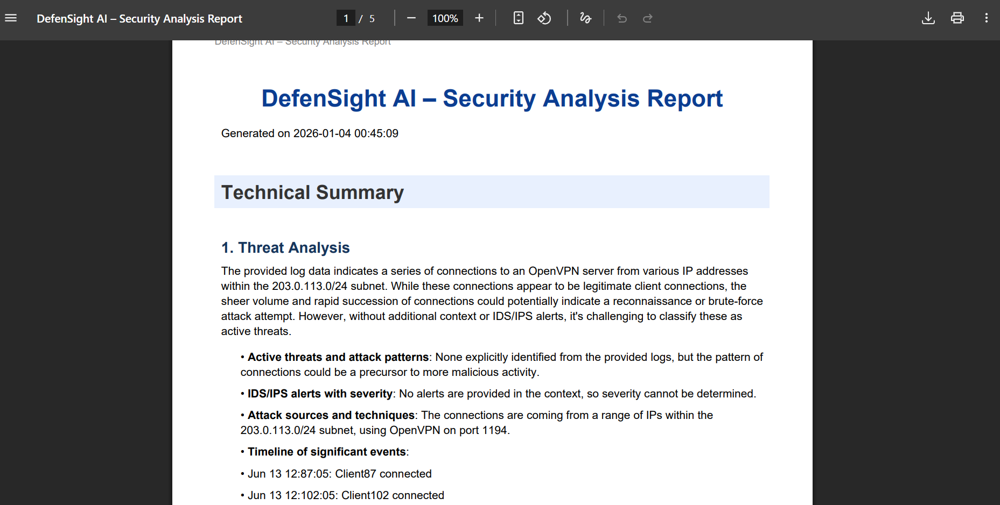

# 🛡️ DefenSight AI - Autonomous Network Defense Copilot

[](https://www.python.org/)
[](https://flask.palletsprojects.com/)
[](LICENSE)
[]()

> **AI-powered security log analysis platform that transforms raw firewall, IDS, and network logs into actionable intelligence using Retrieval-Augmented Generation (RAG) and Large Language Models.**

---

## 📸 Screenshots

### 🔐 User Registration (New User)
  
*A secure onboarding flow where new users create an account. Passwords are hashed using bcrypt and never stored in plaintext.*

---

### 🔑 Login & Authentication
  
*Multi-user authentication system with session-based login protection and bcrypt hashing.*

---

### 📤 Upload & Normalization Trigger
  
*Upload raw security logs (CSV, JSON, XML, LOG, TXT). Files are normalized into a unified schema and indexed automatically.*

---

### ⚙️ Normalization Summary View
  
*Displays total parsed records, detected log types, and key metadata extracted from uploaded files.*

---

### 📂 Detailed Normalized Data View
  
*Tabular structured JSON visualization with preserved fields such as timestamps, severity, source/destination IPs, protocol, and attack category.*

---

### 🧠 Technical Analysis Summary (AI-Generated)
  
*Deep-dive technical summary generated using Retrieval-Augmented Generation over normalized log data.*

---

### 📊 Executive-Level Summary
  
*High-level business-focused security insights written for leadership and non-technical stakeholders.*

---

### 💬 Interactive SOC Assistant (Chat Interface)
  
*Ask security-focused questions in natural language and receive context-aware answers grounded in your logs.*

---

### 📧 Email Report Delivery
  
*Generate reports and email them securely with one click via integrated SMTP support.*

---

### 📄 Downloadable PDF Report
  
*Export fully formatted security assessment reports (technical + executive) for audit and documentation.*

---

## 🎯 Key Features

### 🔐 **Security Analysis**
- **Multi-format log ingestion**: CSV, XML, JSON, LOG, TXT
- **Intelligent normalization**: Automatic type detection and field extraction
- **Semantic search**: 768-dimensional vector embeddings for contextual retrieval
- **RAG-powered insights**: Grounded AI responses using actual log evidence

### 🤖 **AI Capabilities**
- **Groq LLM integration**: Llama 3.3 70B with 128k context window
- **Conversational interface**: Ask questions in natural language
- **Automated reporting**: Technical and executive summaries
- **Threat correlation**: Identify attack patterns across disparate logs

### 📊 **Data Processing**
- **Vector database**: ChromaDB with HNSW indexing for fast similarity search
- **Batch processing**: Efficient embedding generation (64 docs/batch)
- **Session management**: Append or start fresh analysis workflows
- **Real-time ingestion**: Watch folder for automatic log processing

### 🔒 **Authentication & Security**
- **Multi-user system**: Flask-Login with secure session management
- **Password hashing**: Bcrypt with salt for credential storage
- **SQLite database**: Lightweight user management
- **Protected routes**: Login required for all analysis features

---

## 🏗️ Architecture

```
                         ┌──────────────────────────────────────┐
                         │            User Interface            │
                         │   Flask Web App + HTML Templates     │
                         └───────────────┬──────────────────────┘
                                         │
                                         │  User uploads logs /
                                         │  asks questions
                                         ▼
                    ┌──────────────────────────────┐
                    │     Normalization Engine     │
                    │        (format_con.py)       │
                    └───────────────┬──────────────┘
                                    │
                                    │  Converts logs into
                                    │  structured JSON
                                    ▼
                     ┌────────────────────────────┐
                     │  Vectorization + Indexing  │
                     │   (live_ingest.py RAG DB)  │
                     └───────────────┬────────────┘
                                     │
                                     │  Create embeddings
                                     ▼
         ┌────────────────────────────────────────────────────────────┐
         │                      Vector Database                        │
         │                          ChromaDB                           │
         │                                                             │
         │  • Stores 768-dim sentence embeddings                       │
         │  • Supports semantic similarity search                      │
         │  • Uses HNSW indexing for fast recall                       │
         └───────────────┬────────────────────────────────────────────┘
                         │
                         │ Retrieve Top-K Relevant Chunks
                         ▼
                 ┌────────────────────────────┐
                 │       RAG Engine           │
                 │      (rag_engine.py)       │
                 └───────────────┬────────────┘
                                 │
                                 │ Build prompt with retrieved context
                                 ▼
                     ┌───────────────────────────┐
                     │         Groq API          │
                     │     (LLaMA 3.3 model)     │
                     └───────────────┬───────────┘
                                     │
                                     │ AI response /
                                     │ report generation
                                     ▼
                         ┌───────────────────────────────┐
                         │       Final Output Layer      │
                         │   • Technical Summary         │
                         │   • Executive Summary         │
                         │   • PDF Export                │
                         │   • Chat Assistant            │
                         └───────────────────────────────┘

```

**Tech Stack:**
- **Backend**: Python 3.8+, Flask 3.0
- **Vector DB**: ChromaDB 0.4.22
- **Embeddings**: SentenceTransformers (multi-qa-mpnet-base-dot-v1)
- **LLM**: Groq API (Llama 3.3 70B Versatile)
- **Auth**: Flask-Login, bcrypt
- **PDF**: ReportLab
- **Frontend**: Bootstrap 5, Vanilla JS

---

## 🚀 Quick Start

### Prerequisites
- Python 3.8 or higher
- Groq API key
- 4GB+ RAM (8GB recommended)
- 10GB+ free disk space

### Installation

```bash
git clone https://github.com/SudoXploit7/DefenSight-AI.git
cd DefenSight-AI
```

```bash
python -m venv venv
venv\Scripts\activate   # Windows
source venv/bin/activate   # macOS/Linux
```

```bash
pip install -r requirements.txt
```

```bash
cp .env.example .env
```

```bash
python init_db.py init
python init_db.py create-admin
```

```bash
python gui_app.py
```

Visit:
```
http://localhost:5000
```

**Default credentials:**
- Username: `admin`
- Password: `admin123`

> ⚠️ Change these immediately in production.

---

## 🗂️ Project Structure
*(kept same as your original — matching repo)*

---

## 📈 Star History

[](https://star-history.com/#SudoXploit7/DefenSight-AI&Date)

---

## 👥 Author

**Soumyadipta Birabar**

- GitHub: [@SudoXploit7](https://github.com/SudoXploit7)
- LinkedIn: [Soumyadipta Birabar](https://linkedin.com/in/soumyadb)

---

<p align="center">
  <strong>Built with ❤️ for the cybersecurity community</strong>
</p>

<p align="center">
  <sub>DefenSight AI • Transforming Security Data into Actionable Intelligence</sub>
</p>
